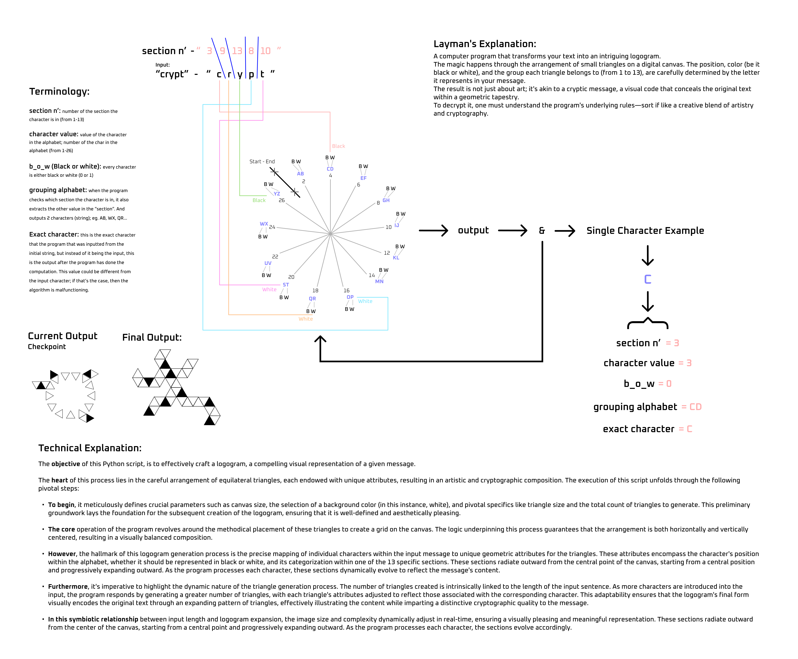

### This project is a work-in-progress! Probably won't work yet

# Tetralogue Logogram Generator 

**Transform Text into Cryptic Logograms with Python**

The Logogram Generator is a Python tool for creating intriguing logograms. It arranges small equilateral triangles on a digital canvas to produce a visual code that conceals the original text within an artistic geometric tapestry.

## Example

Input (String): "crypt"


Logogram: [logogram.png](assets/tetralogue.png)

I am aware that the logogram is called "Tetra"-logue, which is a combining form meaning “four". But thats part of the joke.

**This is also my first time making anything related to cryptography or logograms, so it might not be incredibly advanced**

## Usage

1. **Installation**: Ensure Python is installed on your system.

2. **Clone the Repository**:

    ```bash
    git clone https://github.com/strumberr/tetralogue-logogram.git
    cd tetralogue-logogram
    ```

3. **Run the Script**:

    ```bash
    python logogram_comb.py "Your message"
    ```

   Replace `"Your message"` with the text you want to transform into a logogram.

4. **Output**: The script generates a logogram as an image file in the same directory.

## How It Works

The logogram generation process involves these key steps:

1. **Parameter Configuration**: Set canvas size, background color (typically white), triangle size, and total triangle count.

2. **Triangle Grid Formation**: Place equilateral triangles to create a centered grid for visual balance.

3. **Mapping Characters to Triangles**: Each character maps to geometric attributes, determining position in the alphabet, color (black or white), and group (1 to 13).

4. **Dynamic Triangle Generation**: The script adapts the number of triangles to the input message's length. This process visually encodes the original text through an expanding pattern of triangles.

5. **Expanding Sections**: Thirteen sections radiate outward from the canvas center, evolving as characters are processed.


## License

This project is under the MIT License - see the [LICENSE](LICENSE) file for details.

---

*The Logogram Generator blends artistry and cryptography to create compelling visual representations of text. Experiment and share your logograms with the world! For questions or issues*
